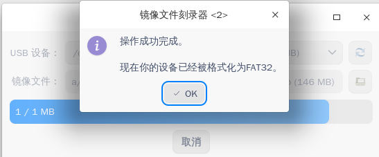

# Summer2021-No.15 开发iso刻录DDE桌面应用

## 介绍
https://gitee.com/openeuler-competition/summer-2021/issues/I3E9CG

具备将可启动iso镜像刻录至u盘的功能，另外支持U盘存储空间还原和刻录校验功能。

## 软件架构
使用C++进行程序的编写，QT5框架进行软件前端的编写，可在Linux中运行（特别针对openEuler 20.03 SP1下Deepin桌面）。

识别U盘设备直接调用Linux提供的接口`libudev`。=> [usbdevice.cpp](usbdevice.cpp)

写入镜像使用QIODevice类，然后使用QFile进行镜像的写入操作。=> [imagewriter.cpp](imagewriter.cpp)

清除将使用`mkfs`直接调用命令进行格式化的形式来实现。=> [mainwindow.cpp](mainwindow.cpp)

验证则直接使用shell脚本进行实现，通过UI调用。=> [verifyimagewriter](verifyimagewriter)

## 安装教程

```bash
qmake-qt5 ImageWriter.pro
sudo make install
```

#### 使用说明

1. 安装完成后，在`启动器`中点击`镜像文件刻录器`即可运行程序。

2. 根据提示输入root密码，点击`认证`。

3. 认证成功后即进入软件主界面。

4. 插入U盘，过一会儿即会自动显示出当前系统中新插入U盘，你可以在已插入的U盘中进行选择需要操作的U盘。你也可以手动点击刷新图标进行更新。

5. 然后点击打开文件图标，在对话框中选择源镜像文件，支持选择`iso`，`bin`，`img`格式的磁盘镜像。

6. 随后可以点击`写入`按钮，在进一步确认后，写入将开始，显示进度条和`取消`按钮，如果用户决定`取消`，则停止操作。


7. 要验证写入的U盘的完整性，请点击`验证`按钮，将会在屏幕顶部显示通知提示结果。这将比较磁盘镜像文件和U盘的数据散列号，如果镜像比较大，可能需要等待一段时间。


8. 如果要还原U盘设备，请点击`清除`按钮。它将从磁盘中删除分区数据，并且您将能够将其格式化为FAT32以达到最大容量。



#### 参与贡献

1.  Fork 本仓库
2.  新建 Feat_xxx 分支
3.  提交代码
4.  新建 Pull Request
